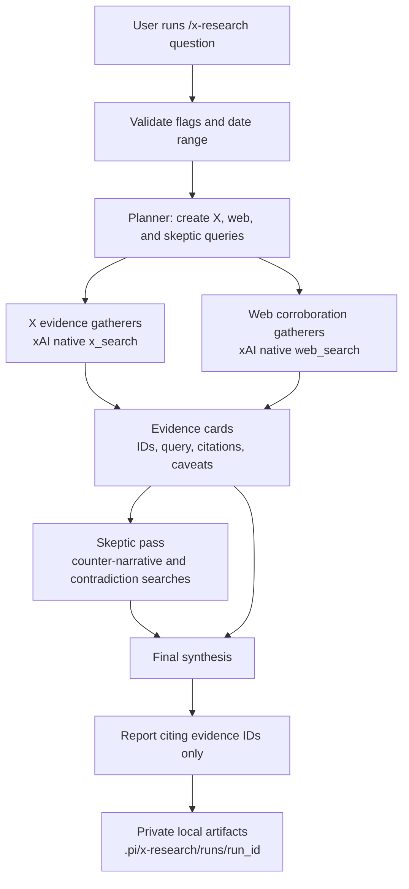

# pi-x-research

Standalone [Pi](https://pi.dev) extension for deep research over X and the web using xAI's native `x_search` and `web_search` tools.

It adds one command:

```text
/x-research [--from YYYY-MM-DD] [--to YYYY-MM-DD] [--angles N] <question>
```

## Research workflow



The command runs an evidence-first workflow:

1. validates input and date flags;
2. plans X/web/skeptic queries;
3. gathers X evidence with native xAI `x_search`;
4. gathers corroborating web evidence with native xAI `web_search`;
5. runs a skeptic/counter-evidence pass;
6. synthesizes a cited report from evidence only;
7. saves artifacts under `.pi/x-research/runs/<run_id>/` with private file permissions.

Search failures are recorded as failed evidence items where possible instead of aborting the whole run.

## Install

From GitHub:

```bash
pi install git:github.com/paulbrav/pi-x-research
```

Or test without installing permanently:

```bash
pi -e git:github.com/paulbrav/pi-x-research
```

## Configuration

Set an xAI API key:

```bash
export XAI_API_KEY=...
```

Optional aliases/settings:

```bash
# accepted key alias
export X_AI_API_KEY=...

# optional model override; must support xAI Responses tools/search
export X_RESEARCH_MODEL=grok-4.3
```

Do **not** pass other providers' API keys. The extension always calls xAI's endpoint: `https://api.x.ai/v1/responses`.

By default the package exposes only the `/x-research` command. If you also want the current Pi agent to be able to call standalone search tools, opt in explicitly:

```bash
export X_RESEARCH_REGISTER_TOOLS=1
```

That registers:

- `x_search`
- `xai_web_search`

Raw provider payloads are not returned in tool details by default. To include them for debugging:

```bash
export X_RESEARCH_INCLUDE_RAW_DETAILS=1
```

## Usage

```text
/x-research --from 2026-06-23 --to 2026-06-30 what are people on X saying about <topic>
```

Artifacts are written to:

```text
.pi/x-research/runs/<opaque_run_id>/
  report.md
  evidence.jsonl
  run.json
```

## Package manifest

Pi loads the extension from `package.json`:

```json
{
  "pi": {
    "extensions": ["extensions/x-research/index.ts"]
  }
}
```

## Development

```bash
npm install
npm run check
pi -e ./extensions/x-research/index.ts
```

## Security and privacy

Pi extensions run with your user permissions. Review source before installing any third-party Pi package.

This extension:

- sends research prompts, generated queries, and retrieved evidence to xAI;
- stores local reports/evidence under `.pi/x-research/runs/` with `0700` directories and `0600` files;
- does not intentionally write API keys to artifacts;
- treats X posts and web pages as untrusted quoted data during synthesis;
- registers no global network tools unless `X_RESEARCH_REGISTER_TOOLS=1` is set.

If you opt into global tools, any Pi agent in that session can send tool input to xAI. Do not enable that in untrusted repositories or sessions containing secrets.
